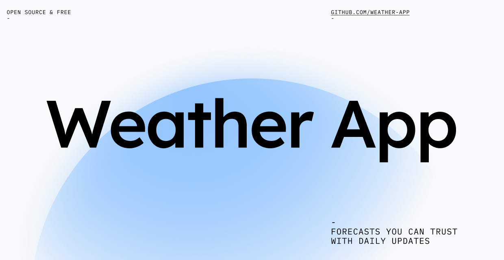
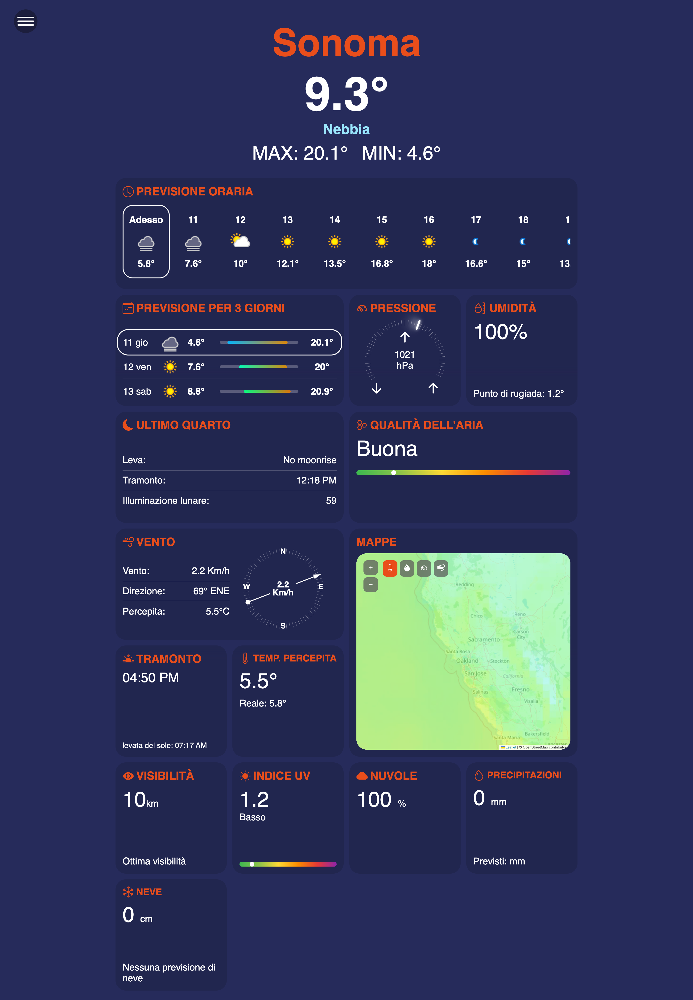

## Description
Responsive weather application that shows current conditions and short‑term forecasts based on the user’s location or a searched city.  
The interface provides a complete overview of temperature, feels‑like temperature, humidity, wind, precipitation, snow, air quality, cloud cover, pressure, visibility, UV index and daylight/nighttime hours, integrated with an interactive map.  
The backend acts as a secure proxy to the external third‑party weather API, handling API keys and query parameters.

## Deployment or Demo
- Deployed URL: https://mattiaortolani-weather-app.vercel.app/

## Desktop Preview


## Technologies Used
- `Angular 19` with standalone components for the user interface  
- `TypeScript` for strongly typed application logic  
- `RxJS` for reactive handling of HTTP calls  
- `Angular CLI` and `@angular-devkit/build-angular` for build, development and testing  
- `Leaflet` for the interactive weather map  
- `zone.js` for Angular change detection  
- `Karma` and `Jasmine` for unit testing  
- `concurrently` to run frontend, backend and public tunnel in parallel  
- `api/` directory with serverless‑style backend functions (e.g. Vercel)  
- External weather service `WeatherAPI` (consumed through the server‑side proxy)

## Installation
1. Clone the repository to your local machine.  
2. Move into the project folder:
   ```bash
   cd weather-app
   ```
3. Install the dependencies:
   ```bash
   npm install
   ```
4. (Optional, for full‑stack development) Configure the environment variable `API_KEY` with your WeatherAPI key for the backend (`api/forecast.js`, `api/searchSuggestion.js`).

## Usage
- Start frontend only (if the backend is already deployed elsewhere):
  ```bash
  npm start
  ```
- Start both frontend and backend locally with `/api` proxied to `http://localhost:3000`:
  ```bash
  npm run start:all
  ```
  - `start:backend`: runs the backend environment (e.g. `vercel dev`) on port `3000`.  
  - `start:frontend`: runs Angular on port `4200` with `proxy.conf.json` for routing `/api` calls.

- To access the application, open the browser at:
  - `http://localhost:4200`

On startup:  
- If the user grants geolocation permissions, the app uses the browser coordinates to fetch forecasts.  
- Alternatively, the user can search for a city via the search bar; the backend returns location suggestions and forecasts for the selected place.  
- The interface displays a weather dashboard, hourly and daily charts, map, air‑quality indicators and other informative widgets.

## Project Structure
```text
weather-app/
├─ api/
│  ├─ forecast.js          # Serverless-style function for weather forecasts
│  └─ searchSuggestion.js  # Serverless-style function for search suggestions
├─ public/
│  ├─ desktop-application.png  # Desktop screenshot
│  ├─ mobile-desktop.MP4       # Mobile preview (not embedded in README)
│  ├─ day.png, night.png       # Day/night theme images
│  └─ icon.png                 # Application icon
├─ src/
│  ├─ main.ts              # Angular bootstrap
│  ├─ index.html           # Main HTML document
│  ├─ styles.scss          # Global styles
│  └─ app/
│     ├─ app.component.*   # Root component and main layout
│     ├─ app.config.ts     # Routing/bootstrap configuration
│     ├─ app.service.ts    # Service for geolocation and internal API calls
│     ├─ header/           # Header and main controls
│     ├─ search-bar/       # City search with suggestions
│     ├─ location-permission/ # Geolocation permission handling
│     ├─ week-temperature/     # Daily temperatures
│     ├─ hours-temperature/    # Hourly temperatures
│     ├─ feels-like-temperature/ # Feels-like temperature
│     ├─ uv/, humidity/, wind/     # UV, humidity and wind indicators
│     ├─ precipitation/, snow/     # Precipitation and snow
│     ├─ cloud-cover/, visibility/ # Cloud cover and visibility
│     ├─ air-quality/, pressure/   # Air quality and pressure
│     ├─ sun-hours/, moon-hours/   # Sunlight and nighttime hours
│     ├─ maps/                     # Weather map with Leaflet
│     ├─ loading-item/             # Loading component
│     └─ menu/                     # Side menu or settings
├─ angular.json           # Angular workspace configuration
├─ proxy.conf.json        # Proxy `/api` → `http://localhost:3000`
├─ package.json           # NPM scripts and dependencies
├─ tsconfig*.json         # TypeScript configuration files
└─ dist/                  # Generated production build
```

## Internal Functioning
- **Overall architecture**  
  - Single Page Application based on Angular with the root component `AppComponent`.  
  - Standalone modular components for each widget (temperature, wind, UV, maps, etc.), imported into the root component.  
  - `AppService` centralizes geolocation logic and internal API calls (`/api/forecast`, `/api/searchSuggestion`).

- **Initial data flow**  
  - In `ngOnInit`, `AppComponent` calls `getCurrentPosition()` from `AppService`, which uses `navigator.geolocation` to obtain latitude and longitude from the browser.  
  - On success, it calls `getForecast(lat, lon)`, which performs an HTTP GET request to the internal endpoint `/api/forecast`.  
  - The response (weather forecast) is stored in `weatherData`, and the loading state is set to `resolved`; in case of error, error messages and the `error` state are set.

- **Manual search and suggestions**  
  - The search bar sends user input to `AppService`, which calls:
    - `getSuggestions(query)` → `GET /api/searchSuggestion` to obtain location suggestions.  
    - `getForecastByCity(city)` → `GET /api/forecast?q={city}` to load forecasts for the selected city.  
  - `AppComponent` receives events from child components (e.g. selected day/hour) and updates `selectedDay` and `hourSelected`, propagating data to the widgets that require it.

- **Weather widgets and helper logic**  
  - Components such as `week-temperature`, `hours-temperature`, `uv`, `humidity`, `air-quality`, `sun-hours`, `moon-hours`, `wind`, `precipitation`, `snow`, `pressure`, `visibility`, `cloud-cover`, `maps` access specific portions of `weatherData` to display charts, indicators and maps.  
  - Dedicated methods in `AppComponent` compute derived values, for example:
    - Previous pressure value relative to the selected hour (`OnprevPressure`).  
    - Upcoming days with precipitation (`OnPrecipitationForecastDay`).  
    - Upcoming days with snow (`OnSnowForecastDay`).  
  - Utility components like `loading-item` and `location-permission` manage loading states and geolocation permission requests.

- **Backend and proxy**  
  - The functions in `api/` are designed as serverless endpoints:
    - They read parameters from the query string (`lat`, `lon`, `q`, `days`, `lang`).  
    - They validate input and check for the `API_KEY` environment variable.  
    - They call the external WeatherAPI service, handle errors and return normalized JSON to the frontend.  
  - `proxy.conf.json` routes all local `/api` requests to `http://localhost:3000`, keeping frontend (port `4200`) and backend separated.

## APIs Used

### Internal APIs (project backend)

- **`GET /api/forecast`**  
  - Description: returns detailed weather forecasts and air‑quality information.  
  - Query parameters:
    - `lat` (number, optional) – latitude.  
    - `lon` (number, optional) – longitude.  
    - `q` (string, optional) – city name or `"lat,lon"` string as an alternative to `lat`/`lon`.  
    - `days` (string, optional, default `3`) – number of forecast days.  
    - `lang` (string, optional, default `it`) – language for WeatherAPI textual responses.  
  - Rules:
    - `lat`/`lon` take precedence; if not provided, `q` is used instead.  
    - If no valid parameter is provided, the endpoint returns `400` with an error message.  
    - Requires `process.env.API_KEY` to be set; otherwise returns `500`.  
  - Output:
    - JSON compatible with the WeatherAPI `forecast.json` response (current conditions, hourly and daily forecasts, air quality).

- **`GET /api/searchSuggestion`**  
  - Description: provides location suggestions based on a search string.  
  - Query parameters:
    - `q` (string, required) – city or partial string, optionally `"lat,lon"`.  
    - `lang` (string, optional, default `it`) – language for results.  
  - Rules:
    - If `q` is empty, the endpoint returns `400` with an error message.  
    - Requires the `API_KEY` environment variable; otherwise returns `500`.  
  - Output:
    - JSON array of results, structured like WeatherAPI `search.json`.

### External APIs (WeatherAPI)

- **`https://api.weatherapi.com/v1/forecast.json`**  
  - Used by `api/forecast.js`.  
  - Main parameters:
    - `key` – API key (`process.env.API_KEY`).  
    - `q` – location (city name or `"lat,lon"`).  
    - `days` – number of forecast days.  
    - `aqi` – `yes` to include air‑quality data.  
    - `lang` – language for textual descriptions.

- **`https://api.weatherapi.com/v1/search.json`**  
  - Used by `api/searchSuggestion.js`.  
  - Main parameters:
    - `key` – API key (`process.env.API_KEY`).  
    - `q` – search string.  
    - `lang` – language for results.

Integration happens exclusively through the project backend: the frontend calls `/api` endpoints, while the `API_KEY` is managed only on the server side.
